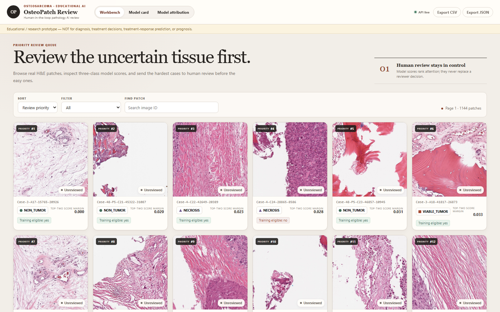
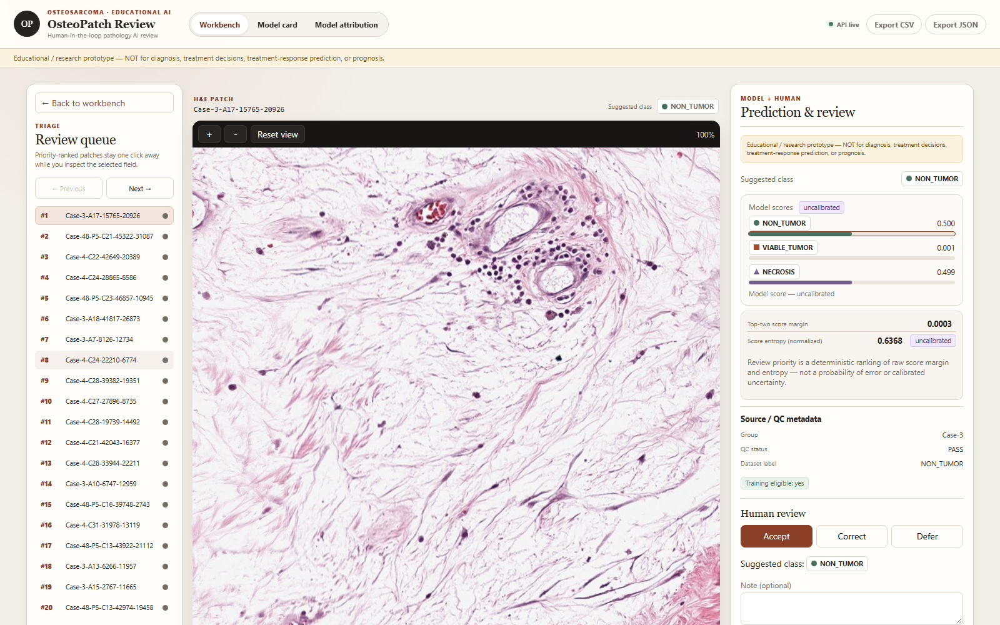
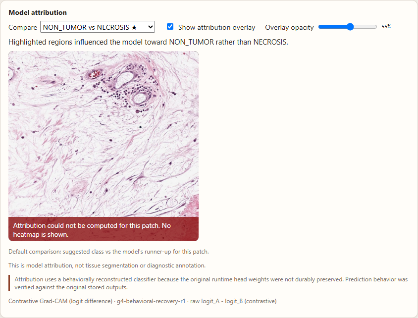
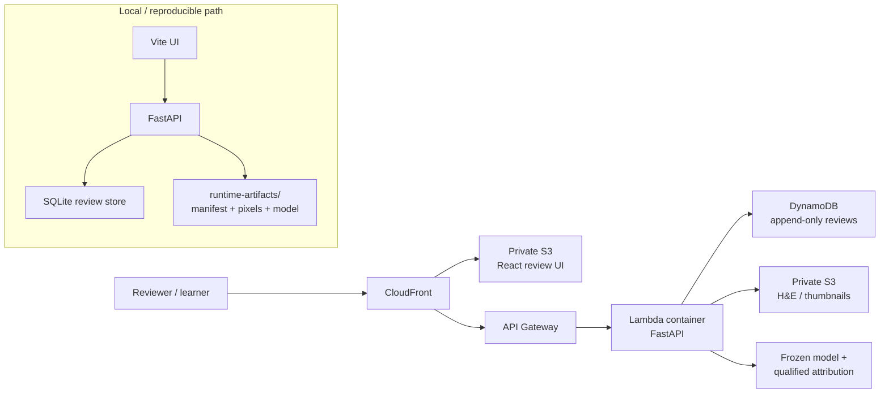

# OsteoPatch Review

> **Human-in-the-loop pathology AI for educational osteosarcoma patch review.**<br/>
> Browse real H&E patches, surface uncertain cases first, inspect model scores and contrastive attribution, record reviewer decisions, and keep the full evidence trail visible.

[](../../actions/workflows/ci.yml)


**Live demo:** https://dgv0wpd8tglrw.cloudfront.net<br/>
**Current deployed scope:** deterministic 50-image demo subset · full locally verified collection: 1,144 patches

> [!CAUTION]
> **Educational / research prototype only. Not for diagnosis, treatment decisions, treatment-response prediction, prognosis, or clinical reporting.** Model outputs are uncalibrated class scores, not disease probabilities.

<p align="center">
  
</p>

---

## Why OsteoPatch

Pathology review is rarely limited by the number of images alone. The hard part is **where to look first**, what the model is actually saying, and how to preserve a reviewer’s decision without turning an experimental model into an opaque clinical claim.

OsteoPatch is built around that review loop:

**Browse patches → prioritize uncertainty → inspect H&E + scores → compare contrastive attribution → accept / correct / defer → preserve history → export**

The model assists with **attention and triage**. The human reviewer remains the authority.

## What is implemented

| Capability | Current state |
|---|---|
| Three-class patch model | `NON_TUMOR`, `VIABLE_TUMOR`, `NECROSIS` |
| Human review | Accept, correct, or defer with revision history |
| Uncertainty-first queue | Deterministic ordering from score margin + normalized entropy |
| Image review | Zoom/pan H&E viewer with QC/source context |
| Attribution | Contrastive Grad-CAM; explicitly **not** segmentation |
| Model evidence | Frozen model card + full limitation catalog + retirement criteria |
| Export | CSV / JSON review exports |
| Local stack | FastAPI + React/Vite + SQLite/read-model artifacts |
| AWS demo | CloudFront + private S3 + API Gateway + Lambda container + DynamoDB |
| Enterprise layer | Project tenancy, RBAC, audit chain, governance, registry, drift monitoring |
| Verification | Backend, frontend, build, static, smoke, and deployment evidence |

### Current verification snapshot

- **Backend:** 110 passed, 11 intentional environment-gated skips
- **G6 review UI:** 29 tests passed + production TypeScript/Vite build
- **Enterprise UI:** 2 tests passed + production build
- **Deployed health:** `baseline-frozen-g4`, 50 indexed/predicted demo patches
- **Full local collection:** 1,144 patches
- **Model scores:** uncalibrated; never presented as probabilities

The weakest-class and cohort/evaluation caveats are not hidden. Open **Model card** in the app for the complete limitations catalog.

## Review experience

<table>
<tr>
<td width="50%">

</td>
<td width="50%">

</td>
</tr>
<tr>
<td><b>Human review</b><br/>H&E, model scores, QC metadata, revision-aware accept/correct/defer.</td>
<td><b>Qualified attribution</b><br/>Contrastive Grad-CAM with recovery and non-segmentation disclosures always visible.</td>
</tr>
</table>

## Architecture



The browser uses same-origin `/v1/*` calls in the deployed demo. Static assets remain private behind CloudFront origin access; review state is separated from immutable prediction evidence.

## Model contract

The review surface is deliberately narrow.

| Item | Contract |
|---|---|
| Canonical class order | `NON_TUMOR → VIABLE_TUMOR → NECROSIS` |
| Model version | `baseline-frozen-g4` |
| Frozen bundle identity | SHA-256 pinned in code/evidence |
| Review state | Separate from learned tissue classes |
| Mixed / poor-quality | Review/QC states, **not** a fourth model output |
| Human correction | Stored as review evidence; never auto-retrains the model |
| Attribution | Contrastive explanation of model behavior; **not** tissue segmentation |
| Clinical use | Explicitly out of scope |

See [PROJECT_BRIEF.md](PROJECT_BRIEF.md) and the in-app model card for the governing claims and non-goals.

## Quick start

### 1. Install the locked Python environment

```bash
uv sync --locked --extra dev
```

Optional extras are intentionally separated:

```bash
uv sync --locked --extra dev --extra wsi     # OpenSlide path
uv sync --locked --extra dev --extra model   # Torch / attribution path
```

### 2. Prepare local runtime artifacts

Runtime pixels and model binaries are intentionally not committed to Git.

```bash
uv run python scripts/prepare_runtime.py
```

The script locates the local runtime bundle and verifies expected identities before the application uses it.

### 3. Start the review API

```bash
uv run uvicorn osteopatch.app:app --app-dir app/g6/backend --host 127.0.0.1 --port 8137
```

### 4. Start the UI

```bash
cd app/g6/frontend
npm ci
npm run dev
```

Open http://127.0.0.1:5173.

## Verification

Run the same core gates used by CI:

```bash
uv run pytest app/g6/backend/tests app/g7-enterprise/backend/tests -q

cd app/g6/frontend
npm test
npm run build

cd ../../g7-enterprise/frontend
npm test
npm run build
```

Static checks from the repository root:

```bash
uv run ruff check scripts app/g6/backend/osteopatch/pathology app/g6/backend/osteopatch/app.py app/g6/backend/osteopatch/limitations.py app/g6/backend/osteopatch/projects.py app/g6/backend/osteopatch/modelcard.py app/g6/backend/tests/test_connection_concurrency.py app/g6/deploy/verify_bake.py
uv run mypy
python scripts/sync_requirements.py --check
python scripts/check_deps.py
```

For a real local HTTP workflow over the recovered dataset:

```bash
uv run python app/local-tester.py --out docs/evidence/smoke-result.json
```

For the full reviewer journey in a real Chromium browser (throwaway review DB; canonical DB hash-checked before/after):

```bash
python scripts/e2e_ui.py
```

The browser suite covers priority sorting/filtering, H&E review, accept/correct/defer, model-card limitations, honest attribution failure behavior, and export provenance.

## Repository map

```text
app/
├─ g6/
│  ├─ backend/osteopatch/     # review API, evidence, model card, attribution
│  ├─ frontend/               # reviewer-facing React/Vite application
│  └─ deploy/                 # Lambda container + AWS CDK demo infrastructure
├─ g7-enterprise/
│  ├─ backend/enterprise/     # RBAC, tenancy, audit, governance, registry, drift
│  └─ frontend/               # enterprise review / model-registry UI
└─ local-tester.py            # real HTTP end-to-end verifier

aidlc-docs/                   # AI-DLC state and certified execution evidence
docs/                         # architecture, contracts, UX, audits, test/release plans
runtime-artifacts/            # local pixels/models/cache — gitignored by design
scripts/                      # runtime recovery, dependency and verification tooling
```

## AWS demo

The current hackathon deployment is intentionally small and serverless:

- private S3 + CloudFront for the React app
- HTTP API Gateway + Lambda container for FastAPI
- DynamoDB on-demand review events
- private S3 for image assets
- deterministic 50-image public demo scope

Infrastructure is under [`app/g6/deploy/cdk/`](app/g6/deploy/cdk/). Nothing in the normal local setup creates AWS resources.

## Evidence & design documents

- [Current-state audit](docs/current-state-audit.md)
- [Project brief and safety scope](PROJECT_BRIEF.md)
- [Product UX and acceptance criteria](docs/03_product_ux_and_acceptance.md)
- [Architecture, security, and cost](docs/04_architecture_security_cost.md)
- [Data and API contracts](docs/08_data_and_api_contracts.md)
- [Enterprise design](docs/ENTERPRISE_DESIGN.md)
- [G8 deployment summary](aidlc-docs/g8-deployment-summary.md)
- [AI-DLC state](aidlc-docs/aidlc-state.md)

## Design principles

1. **Show uncertainty, do not disguise it.**
2. **Fail closed:** if pixels, predictions, attribution, or evidence cannot be loaded, the UI does not fabricate a substitute.
3. **Human review is first-class:** corrections are durable review events, not hidden model feedback.
4. **Evidence is inspectable:** model identity, preprocessing, evaluation caveats, and limitation retirement criteria are explicit.
5. **Keep clinical claims out:** this is a research/education platform, not a medical device.

---

### Safety / intended use

**English:** Educational research prototype only. Not for diagnosis, treatment decisions, or predicting treatment response.<br/>
**ไทย:** ต้นแบบเพื่อการเรียนรู้และการวิจัยเท่านั้น ไม่ใช้วินิจฉัย ตัดสินใจรักษา หรือทำนายผลการรักษา

This repository currently uses a **proprietary** license declaration in `pyproject.toml`. Do not assume open-source reuse rights from repository visibility.
