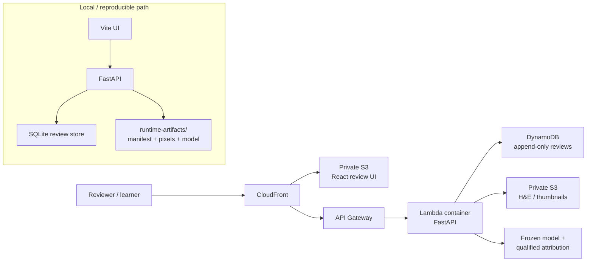

# OsteoPatch Review

> **Human-in-the-loop pathology AI for educational osteosarcoma patch review.**<br/>
> Browse real H&E patches, surface uncertain cases first, inspect model scores and contrastive attribution, record reviewer decisions, and keep the full evidence trail visible.

[](https://github.com/Enksodsoon/Osteopatch/actions/workflows/ci.yml)


**[Project website](https://enksodsoon.github.io/Osteopatch/)** · **[Developer documentation](docs/README.md)** · **[AI agent handoff](docs/agent-handoff.md)** · **[Data inventory](docs/data-inventory.md)** · **[Model evidence](docs/model-evidence.md)** · **[Contributing](CONTRIBUTING.md)**

**Repository:** <https://github.com/Enksodsoon/Osteopatch> — renamed from `osteopatch-review`. Existing old URLs redirect, but update stale clones with:<br/>
`git remote set-url origin https://github.com/Enksodsoon/Osteopatch.git`<br/>
**Workshop review demo:** https://dgv0wpd8tglrw.cloudfront.net<br/>
**Demo scope:** deterministic 50-image subset · full locally verified source collection: 1,144 patches.<br/>
The website is static documentation, not the review API. The AWS workshop deployment may be older than `main` and depends on its separate access/cost configuration.

> [!CAUTION]
> **Educational / research prototype only. Not for diagnosis, treatment decisions, treatment-response prediction, prognosis, or clinical reporting.** Model outputs are uncalibrated class scores, not disease probabilities.

<p align="center">
  
</p>

---

## Why OsteoPatch

Pathology review is rarely limited by the number of images alone. The hard part is **where to look first**, what the model is actually saying, and how to preserve a reviewer’s decision without turning an experimental model into an opaque clinical claim.

OsteoPatch is built around that review loop:

**Browse patches → prioritize uncertainty → inspect H&E + scores → compare contrastive attribution → accept / correct / defer → preserve history → export**

The model supports **educational review prioritization**, not clinical urgency. The human reviewer remains the authority.

> **Model evidence:** frozen pooled out-of-fold macro-F1 is **0.562311** and viable-tumor recall is **0.110345** across an exploratory four-group evaluation. Patient-level independence is unverified. The original G4 binary is absent; the recovered attribution head is a different artifact. [Read the evidence and reproducibility boundaries](docs/model-evidence.md).

## What is implemented

| Capability | Current state |
|---|---|
| Three-class patch model | `NON_TUMOR`, `VIABLE_TUMOR`, `NECROSIS` |
| Human review | Accept, correct, or defer with revision history |
| Uncertainty-first queue | Deterministic ordering from score margin + normalized entropy |
| Image review | Zoom/pan H&E viewer with QC/source context |
| Attribution | Contrastive Grad-CAM; explicitly **not** segmentation |
| Model evidence | Frozen model card + full limitation catalog + retirement criteria |
| Export | CSV / JSON review exports |
| Local stack | FastAPI + React/Vite + SQLite/read-model artifacts |
| AWS demo | CloudFront + private S3 + API Gateway + Lambda container + DynamoDB |
| Enterprise layer | Project tenancy, RBAC, audit chain, governance, registry, drift monitoring |
| Verification | Backend, frontend, build, static, smoke, and deployment evidence |

### Repository verification snapshot — 6 October 2026

- **Backend (with the optional `model` extra installed):** 228 passed, 5 intentional environment-gated skips. Without that extra the torch-gated tests skip and the count is lower — a smaller number from a different environment, not a regression. Which optional runtimes a machine actually has is recorded per-machine in [docs/evidence/runtime-capability.json](docs/evidence/runtime-capability.json).
- **G6 review UI:** 29 tests passed + production TypeScript/Vite build
- **Enterprise UI:** 2 tests passed + production build
- **Unified authenticated surface:** every new `/v1/*` route driven over real HTTP as all six demo personas, capability gates confirmed to reject, tenancy 404s confirmed on the pixel and attribution paths — [docs/evidence/unified-surface.json](docs/evidence/unified-surface.json)
- **Live inference:** authenticated upload → real forward pass through the recovered head → read-back over HTTP, 43 checks; frozen corpus rows byte-identical before and after, canonical store never written — [docs/evidence/live-inference.json](docs/evidence/live-inference.json)
- **Unified frontend:** 23 tests passed + production TypeScript/Vite build. The full journey — login → 50-image gallery → import a patch or slide → live result rendered with honest confidence banding — was exercised in a real browser against the running backend, as both a writer and a reader-only persona
- **Demo slide:** reports `level_count: 1`, `is_pyramid: false`, mpp/vendor null — recorded as read, never claimed as a pyramid — [docs/evidence/demo-slide.json](docs/evidence/demo-slide.json)
- **Recorded workshop-demo health:** `baseline-frozen-g4`, 50 indexed/predicted demo patches; verify live deployment separately
- **Full local collection:** 1,144 patches
- **Model scores:** uncalibrated; never presented as probabilities

The weakest-class and cohort/evaluation caveats are not hidden. Open **Model card** in the app for the complete limitations catalog.

## Review experience

<table>
<tr>
<td width="50%">

</td>
<td width="50%">

</td>
</tr>
<tr>
<td><b>Human review</b><br/>H&E, model scores, QC metadata, revision-aware accept/correct/defer.</td>
<td><b>Qualified attribution</b><br/>Contrastive Grad-CAM with recovery and non-segmentation disclosures always visible.</td>
</tr>
</table>

## Architecture



The browser uses same-origin `/v1/*` calls in the deployed demo. Static assets remain private behind CloudFront origin access; review state is separated from immutable prediction evidence.

## Model contract

The review surface is deliberately narrow.

| Item | Contract |
|---|---|
| Canonical class order | `NON_TUMOR → VIABLE_TUMOR → NECROSIS` |
| Model version | `baseline-frozen-g4` |
| Frozen bundle identity | SHA-256 pinned in code/evidence |
| Review state | Separate from learned tissue classes |
| Mixed / poor-quality | Review/QC states, **not** a fourth model output |
| Human correction | Stored as review evidence; never auto-retrains the model |
| Attribution | Contrastive explanation of model behavior; **not** tissue segmentation |
| Clinical use | Explicitly out of scope |

See [PROJECT_BRIEF.md](PROJECT_BRIEF.md) and the in-app model card for the governing claims and non-goals.

## Quick start

For a complete agent handoff, populated-demo setup, dataset/model inventory and tested workflow, start with [the AI agent guide](docs/agent-handoff.md), [the data inventory](docs/data-inventory.md) and the [latest local demo verification](docs/evidence/demo-readiness.md). The repository snapshot below is dated 6 October 2026; the newer verification record is dated 7 October 2026.

### 1. Install the locked Python environment

```bash
uv sync --locked --extra dev
```

Optional extras are intentionally separated:

```bash
uv sync --locked --extra dev --extra wsi     # OpenSlide path
uv sync --locked --extra dev --extra model   # Torch / attribution path
```

The `model` extra is what makes contrastive attribution return a real heatmap. It
is ~1–2 GB and **never required to start or serve the app** — the review serve
path is proven torch-free by `test_serve_path_torch_free.py`, which runs the
routes in a subprocess that refuses to resolve torch. Fetch the frozen encoder
weights once so a demo run needs no network:

```bash
uv run python scripts/runtime_capability.py --warm
uv run python scripts/runtime_capability.py --out docs/evidence/runtime-capability.json
```

Without the extra, attribution degrades to an explicit 503 notice — never a
fabricated heatmap. `scripts/runtime_capability.py` records what a given machine
can actually do and exits 0 either way.

### 2. Prepare local runtime artifacts

Runtime pixels and model binaries are intentionally not committed to Git.

```bash
uv run python scripts/prepare_runtime.py
```

The script locates the local runtime bundle and verifies expected identities before the application uses it.

### 3. Start the local educational demo

Run one command from the repository root:

```bash
make unified-app
```

It verifies and copies the review database, patch pixels, and available recorded
inference artifacts into a temporary workspace, then serves the built UI and API
from one local origin. Open the URL printed by the command and sign in as
`reviewer@demo`. Review changes and uploads stay in that temporary copy. Press
Ctrl+C and run `make unified-app` again for a clean reset. The source runtime
bundle remains read-only. Real inference appears only when pinned runtime model
and capability checks pass; recorded results retain their original timestamp
and provenance and do not run inference again.
### 3b. The original G6 review app

Still available, and still what the G6-only checks exercise:

```bash
uv run uvicorn osteopatch.app:app --app-dir app/g6/backend --host 127.0.0.1 --port 8137
cd app/g6/frontend && npm ci && npm run dev
```

Open http://127.0.0.1:5173.

### Frontend development (hot reload)

`npm run dev` in `app/g7-enterprise/frontend` serves the UI on 5174 and proxies
`/v1`, `/api` and `/auth` to the backend on 8140, so CORS never applies during
development either. The production bundle is what the backend serves at `/`.

## Verification

Run the same core gates used by CI:

```bash
uv run pytest app/g6/backend/tests app/g7-enterprise/backend/tests -q

cd app/g6/frontend
npm test
npm run build

cd ../../g7-enterprise/frontend
npm test
npm run build
```

Static checks from the repository root:

```bash
uv run ruff check scripts app/g6/backend/osteopatch/pathology app/g6/backend/osteopatch/app.py app/g6/backend/osteopatch/limitations.py app/g6/backend/osteopatch/projects.py app/g6/backend/osteopatch/modelcard.py app/g6/backend/tests/test_connection_concurrency.py app/g6/deploy/verify_bake.py
uv run mypy
python scripts/sync_requirements.py --check
python scripts/check_deps.py
```

For a real local HTTP workflow over the recovered dataset:

```bash
uv run python app/local-tester.py --out docs/evidence/smoke-result.json
```

For the full reviewer journey in a real Chromium browser (throwaway review DB; canonical DB hash-checked before/after):

```bash
python scripts/e2e_ui.py
```

The browser suite covers priority sorting/filtering, H&E review, accept/correct/defer, model-card limitations, honest attribution failure behavior, and export provenance.

For the authenticated unified surface over real HTTP, as each demo persona:

```bash
python scripts/verify_unified_surface.py
```

That seeds a demo project with a deterministic 50-image scope, copies the review
store, and exercises every `/v1/*` route plus the capability and tenancy gates.
The canonical database is hashed before and after and the run fails if it moved.

### Live inference on a slide you import

```bash
python scripts/make_demo_slide.py            # build the demo WSI, report what the reader says
python scripts/verify_live_inference.py       # upload -> predict -> read back, over real HTTP
```

`make_demo_slide.py` assembles real corpus patches into a tiled TIFF, then re-opens
it through the same reader the app uses and prints what that reader *actually*
reports. For the current artefact that is a single level with no mpp and no vendor:
the file is valid input, but it is not a pyramid, and the script will not pretend
otherwise (`--require-pyramid` exits non-zero).

`verify_live_inference.py` copies the review store, seeds a demo project, and runs a
real forward pass through the recovered head over HTTP as each persona. It checks the
capability split (`live:analyze` is a writer action, `live:read` a reader action), the
tenancy 404s, the upload error codes, and the honesty fields — then compares the frozen
corpus **by row content** before and after, because writing live rows is supposed to
change the database; only the corpus rows themselves must come out identical.

Live runs are stored in their own `live_run` / `live_tile` tables, never in the frozen
prediction set, and DB constraints make it impossible to stamp the absent original
bundle's identity onto a live row. Responses say when a score is uncalibrated, when a
prediction is indeterminate, and when input properties are simply absent.

### How the UI refuses to look more certain than the model

This is the part worth reviewing. A large, coloured class name reads as a
conclusion no matter what the footnote underneath says, so:

- an **indeterminate** result has no class name at all — the headline says
  "Not determined", the tile is drawn with a hatch, and the score bars stay
  visible so the numbers are still inspectable;
- a **low** separation is reported with the actual top-two gap, and the ribbon
  draws the 0.05 / 0.20 band edges so the thresholds are visible rather than
  asserted;
- mpp, objective power and vendor render as "not in file" — never 0, never blank;
- `truncated` always reports both counts;
- a role that cannot import (student, auditor) is told **why** in words and gets
  no button that would 403. Reading every run stays open to all six personas.

No webfont is loaded. The demo is expected to run without network, so typography
is carried by scale, tracking and tabular numerals rather than by a download that
might fail silently.

## Repository map

```text
app/
├─ g6/
│  ├─ backend/osteopatch/     # review API, evidence, model card, attribution
│  ├─ frontend/               # reviewer-facing React/Vite application
│  └─ deploy/                 # Lambda container + AWS CDK demo infrastructure
├─ g7-enterprise/
│  ├─ backend/enterprise/     # RBAC, tenancy, audit, governance, registry, drift
│  └─ frontend/               # enterprise review / model-registry UI
└─ local-tester.py            # real HTTP end-to-end verifier

aidlc-docs/                   # AI-DLC state and certified execution evidence
docs/                         # architecture, contracts, UX, audits, test/release plans
runtime-artifacts/            # local pixels/models/cache — gitignored by design
scripts/                      # runtime recovery, dependency and verification tooling
```

## AWS demo

The current hackathon deployment is intentionally small and serverless:

- private S3 + CloudFront for the React app
- HTTP API Gateway + Lambda container for FastAPI
- DynamoDB on-demand review events
- private S3 for image assets
- deterministic 50-image public demo scope

Infrastructure is under [`app/g6/deploy/cdk/`](app/g6/deploy/cdk/). Nothing in the normal local setup creates AWS resources.

## Evidence & design documents

- [Current-state audit](docs/current-state-audit.md)
- [Project brief and safety scope](PROJECT_BRIEF.md)
- [Product UX and acceptance criteria](docs/03_product_ux_and_acceptance.md)
- [Architecture, security, and cost](docs/04_architecture_security_cost.md)
- [Data and API contracts](docs/08_data_and_api_contracts.md)
- [Enterprise design](docs/ENTERPRISE_DESIGN.md)
- [G8 deployment summary](aidlc-docs/g8-deployment-summary.md)
- [AI-DLC state](aidlc-docs/aidlc-state.md)

## Design principles

1. **Show uncertainty, do not disguise it.**
2. **Fail closed:** if pixels, predictions, attribution, or evidence cannot be loaded, the UI does not fabricate a substitute.
3. **Human review is first-class:** corrections are durable review events, not hidden model feedback.
4. **Evidence is inspectable:** model identity, preprocessing, evaluation caveats, and limitation retirement criteria are explicit.
5. **Keep clinical claims out:** this is a research/education platform, not a medical device.

---

### Safety / intended use

**English:** Educational research prototype only. Not for diagnosis, treatment decisions, or predicting treatment response.<br/>
**ไทย:** ต้นแบบเพื่อการเรียนรู้และการวิจัยเท่านั้น ไม่ใช้วินิจฉัย ตัดสินใจรักษา หรือทำนายผลการรักษา

This repository currently uses a **proprietary** license declaration in `pyproject.toml`. Do not assume open-source reuse rights from repository visibility.
