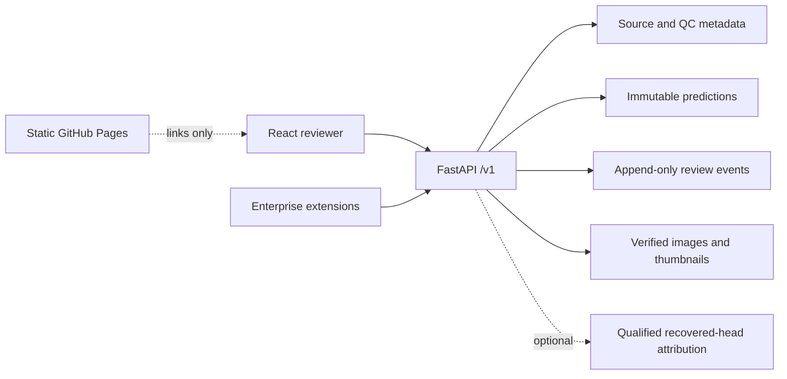

# Architecture

## Component map
| Path | Responsibility |
|---|---|
| `app/g6/backend/osteopatch` | Core FastAPI review API, source/QC reads, immutable predictions, revision-aware reviews, model card and attribution |
| `app/g6/frontend` | React/TypeScript reviewer workbench, H&E viewer, review controls and exports |
| `app/g7-enterprise/backend/enterprise` | Project scope, capability-based roles, audit, governance, registry and worker extensions; delegates core review behavior |
| `app/g7-enterprise/frontend` | Prototype identity, review and registry interface |
| `app/g6/deploy` | Historical Lambda container and AWS CDK deployment contracts |
| `site` | Static documentation/product website; no inference or reviewer data |
| `scripts` / `tests/tooling` | Reproducibility, dependency, publication and repository checks |

The `g6` and `g7-enterprise` directory names are retained for compatibility with imports, tests, evidence paths and deployment scripts. Renaming them requires a separately tested migration, not cosmetic file cleanup.

## Data contracts
Source labels and QC metadata are not model predictions. Predictions are keyed to an explicit model identity and remain immutable. Review events contain accept/correct/defer decisions, revisions and idempotency keys. Review state never becomes a fourth biological model class and never triggers automatic retraining.

The exact class order is `NON_TUMOR`, `VIABLE_TUMOR`, `NECROSIS`. Uncertainty ordering supports educational review, not clinical urgency. The original model and recovered attribution head are separate artifacts; see [model evidence](model-evidence.md).

## Runtime and development
The local reviewer uses SQLite and precomputed predictions. Optional torch dependencies are isolated from the normal web environment. The local API binds to `127.0.0.1:8137`; Vite runs on `127.0.0.1:5173` and proxies `/v1` to the API. Enterprise uses a separate store and development identity mechanism.

Runtime images, binary models and databases live outside Git. Metadata and historical evaluations are tracked to retain provenance. The static website reads only selected public source files and publishes a fixed allowlist, never the repository directory as a whole.

## Deployment distinction
GitHub Pages serves documentation, not FastAPI. The historical workshop application uses CloudFront/private S3, API Gateway, a Lambda image and DynamoDB. Public demo review writes, local development identity, backup/retention and abuse/cost controls require explicit review before broader use. A successful frontend upload does not redeploy or certify the API/model container.

See [deployment](deployment.md), [original API/data contracts](08_data_and_api_contracts.md), [enterprise design](ENTERPRISE_DESIGN.md) and [original architecture/cost plan](04_architecture_security_cost.md).
